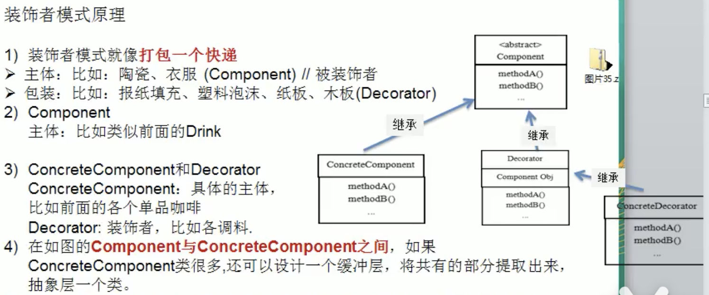
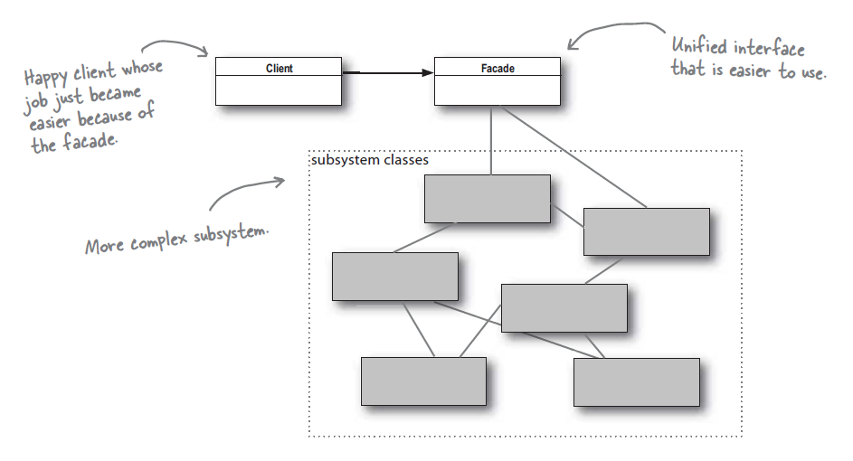
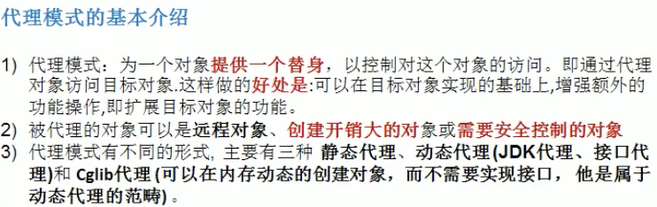

# # Principle

設計模式七大原則：

1. 單一職責原則
2. 接口隔離原則
3. 依賴倒轉（倒置）原則
4. 裡式替換原則
5. 開閉原則
6. 迪米特法則
7. 合成複用原則


設計原則核心思想：

1. 找出應用中可能需要變化之處，把它們獨立出來，不要和那些不需要變化的代碼混在一起
2. 針對接口編程，而不是針對實現編程
3. 為了交互對象之間的松耦合設計而努力


單一職責原則

```java
基本介紹：
  對類來說的，即一個類應該只負責一項職責。如類A負責兩個不同的職責：職責1、職責2。當職責1需求變更而改變A
  時，可能造成職責2執行錯誤，所以需要將類A的粒度分解為A1、A2。
  單一職責注意事項和細節：
  1.降低類的複雜度，一個類只負責一項職責。
  2.提高類的可讀性，可維護性。
  3.降低變更引起的風險。
  4.通常情況下，我們應當遵守單一職責原則，只有邏輯足夠簡單，才可以在代碼級違反單一職責原則；
  只有類中方法數量足夠少，可以在方法級別保持單一職責原則。
```


接口隔離原則（Interface Segregation Principle）

```java
基本介紹：
  1.客戶端不應該依賴不需要的接口，即一個類對另一個類的依賴應該建立在最小的接口上。
```


依賴倒轉原則（Dependence Inversion Principle）

```java
基本介紹：
  依賴倒轉原則是指
  1.高層模塊不應該依賴底層模塊，二者都應該依賴其抽象
  2.抽像不應該依賴細節，細節應該依賴抽象
  3.依賴倒轉的中心思想是面向接口編程。
  4.依賴倒轉原則是基於這樣的設計理念：相對於細節的多變性，抽象的東西要穩定的多。以抽象為基礎搭建的架構比以細節為基礎
  的架構要穩定的多。在Java中，抽象指的是接口或者抽像類，細節就是具體的實現類。
  5.使用接口或抽像類的目的是指定好規範，而不涉及任何具體的操作，把展現細節的任務交給他們的實現類去完成

  依賴關係傳遞的三種方式和應用案例：
  1.接口傳遞
  2.構造方法傳遞
  3.setter方式傳遞

  依賴倒轉原則的注意事項和細節
  1.底層模塊盡量都要有抽像類或接口，或者兩者都有，程序穩定性好。
  2.變量的聲明類型盡量是抽像類或接口，這樣我們的變量引用和實際對象間，就存在一個緩衝層，利於程序擴展和優化。
  3.繼承時遵循裡式替換原則
```


裡式替換原則（Liskov Substitution Principle）

```java
基本介紹：
  1.裡式替換原則是在1988年，有麻省理工學院的一位姓裡的女士提出的。
  2.如果對每個類型為T1的對象o1，都有類型為T2的對象o2，使得以T1定義的所有程序P在所有的對象o1都代還成o2時，程序p
  的行為沒有發生變化，那麼類型T2是類型T1的子類型。換句話說，所有引用基類的地方必須能透明地使用其子類的對象。
  3.在使用繼承時，遵循裡式替換原則，在子類中盡量不要重寫父類的方法。
  4.裡式替換原則告訴我們，繼承實際上是讓兩個類耦合性增強了，在適當的情況下，可以通過聚合、組合、依賴來解決問題。

  面向對像中的繼承性的思考和說明

  1) 繼承包含這樣一層含義:父類中凡是已經實現好的方法，實際上是在設定規範和契約，雖然它不強制要求所有 的子類必須遵循這些契約，
    但是如果子類對這些已經實現的方法任意修改，就會對整個繼承體系造成破壞。
  2) 繼承在給程序設計帶來便利的同時，也帶來了弊端。比如使用繼承會給程序帶來侵入性，程序的可移植性降低，
    增加對象間的耦合性，如果一個類被其他的類所繼承，則當這個類需要修改時，必須考慮到所有的子類，並且 父類修改後，
    所有涉及到子類的功能都有可能產生故障
  3) 問題提出:在編程中，如何正確的使用繼承? => 里氏替換原則
```


開閉原則（Open Closed Principle）

```java
基本介紹：
  1.開閉原則是編程中最基礎、最重要的設計原則。
  2.一個軟件實體如類，模塊和函數應該對擴展開放（對提供方），對修改關閉（對使用方）。用抽象構建框架，用實現擴展細節。
  3.當軟件需要變化時，盡量通過擴展軟件實體的行為來實現變化，而不是通過修改已有代碼來實現變化。
  4.編程中遵循其它原則，以及使用設計模式的目的就是遵循開閉原則。
```


迪米特法則（Demeter Prinnciple）

```java
基本介紹：
  1.一個對象應該對其它對象保持最少的了解
  2.類與類關係越密切，耦合度越大
  3.迪米特法則又叫最少知道原則，即一個類對自己依賴的類知道的越少越好。也就是說，對於被依賴的類不管多複雜，
    都盡量將邏輯封裝在類的內部。對外除了提供public方法，不對外洩露任何信息
  4.迪米特法則還有個更簡單的定義：只與直接朋友有通信。
  5. 直接的朋友：每個對像都會去其他對像有耦合關係，只要兩個對象之間有耦合關係，我們就說這兩個對象之間是朋友
     關係。耦合的方式很多，依賴、關聯、組合、聚合等。其中，我們稱出現成員變量，方法參數，方法返回值中的類為
     直接的朋友，而出現在局部變量中的類不是直接的朋友。也就是說，陌生的類最好不要以局部變量的形式出現在類的
     內部
```


合成複用原則基本介紹：

```java
原則盡量使用合成/聚合的方式，而不是使用繼承
```


# # 創建型設計模式

## 1. 單例模式（singleton）

- 介紹： 所謂單例設計模式，就是採取一定的方法保證在整個軟件系統中，對某個類只能存在一個對象實例，並且該類只提供一個取得其對象實例的方法（靜態方法）。

- 單例設計模式的八種方式：
       1.餓漢式（靜態常量）*
       2.餓漢式（靜態代碼塊）*
       3.懶漢式（線程不安全）
       4.懶漢式（線程安全，同步方法）
       5.懶漢式（線程安全，同步代碼塊）
       6.雙重檢查 *
       7.靜態內部類 *
       8.枚舉 *

- 單例模式註意事項和細節說明：
      1. 單例模式保證了系統內存中只存在一個對象，節省了系統資源，對於一些需要頻繁創建銷毀的對象，使用單例模式
              可以提高系統性能。
         2.  當想實例化一個單例類的時候，必須要記住使用相應的獲取對象的方法，而不是使用new
         3. 單例模式使用的場景：需要頻繁的進行創建和銷毀的對象、創建對象時耗時過多或耗費資源過多（即：重量級對象），
                     但又經常用到的對象、工具類對象、頻繁訪問數據庫或文件的對象（比如數據源、session工廠等）

### Volatile

[Volatile in Java -- 用volatile解決可視性問題](https://www.tpisoftware.com/tpu/articleDetails/1753)

**When to use volatile**

- 在Java裡，每個執行緒有各自的記憶體空間(working memory)，當執行完一段操作後，執行緒會再將剛才使用到的變數的值更新到主記憶體(main memory)裡。其他執行緒則可從主記憶體讀取到變數的最新值。

- 上述特性加快了程式處理的效率，但在多執行緒環境裡卻可能為我們帶來變數可視性(visibility)的問題。即當一個變數的讀取和寫入發生在不同的執行緒時，讀取變數的執行緒有時無法及時看到變數的值的改變(被其他執行緒寫入)，導致資料不一致。

- 此時，可在變數前加上volatile，***此變數會改為不使用各執行緒的\******working memory\******，永遠從主記憶體做存取與讀寫。\***

**volatile vs synchronized**

- 撰寫多執行緒應用程式時，確保資料一致性的兩大原則：
  1. Mutual Exclusion - critical section裡的程式碼一次只能被一個執行緒執行
  2. Visibility – 共享資料的值被某執行緒更改時，其他執行緒可及時看見 

- 使用volatile可確保Visibility，但不具Mutual Exclusion。

- 使用synchronized，則可保證以上兩項特性，代價則是更差的效能。

 用volatile可以幫助我們寫出更簡潔的code。相較用synchronized鎖住某個區塊，因為用volatile像是將同步責任交給JVM，會比我們自己處理更不容易出錯。但如果宣告為volatile的變數經常被使用的話，可能導致程式的效能不如鎖住整個區塊。

**volatile in Java vs C/C++**

- 在Java裡volatile是告訴編譯器變數的值不快取到working memory，讀寫永遠透過main memory。

- 在C/C++裡volatile則是告訴編譯器不要優化我們所撰寫的code，和我們文章上方所討論的同步問題無關係。

**Conclusion:**

由上可知，在某些需要可視性，且沒有資料競速(race condition)的情境，像是：我們在某個執行緒裡寫了個變數，用來做旗標；在別的執行緒查看那個變數，並且變數值的寫入並不依據當前的值做更新。

 或者，我們其實並不那麼在意資料競速可能帶來的誤差，用synchronized顯得殺雞用牛刀時，我們可以使用volatile來達到我們的目的。

 簡言之，當我們需要更多的visibility時，我們可以標記變數為volatile，但它不具備鎖的功能，所以使用上仍須有心理準備可能錯過某些更新。

## 2.3. 工廠模式（factory）

> Tradition:

違反了設計模式的OCP原則，即對擴展開放，對修改關閉，即當我們給類增加新功能的時候，盡量不修改代碼，或者盡可能少修改代碼
 * 比如我們這時要新增加一個Pizza的種類，需要修改OrderPizza代碼 ---> 違反ocp原則


### 2 SimpleFactory

> Example : JDK Calendar

封裝創建對象的代碼 --->  OrderPizza 使用 SimpleFactory 創建對象

把創建Pizza對象分裝到一個類中，這樣我們有新的Pizza種類時，只需要修改該類就可以，其它有創建到Pizza對象的代碼不需要修改 --->   簡單工廠模式


> MethodFactory

定意義一個創建對象的抽象方法，由子類決定要實例化的對象  --->  把對象的實例化推遲到子類


### 3. Abstractactory

結合SimpleFactory（把創建Pizza對象分裝到一個類中）和MethodFactory（把對象的實例化推遲到子類）

對SimpleFactory進行改進（抽象），將工廠抽象為兩層，抽象工廠和具體實現的工廠子類，可以根據創建對象的類型使用對應的工廠子類，這樣簡單工廠就變成工廠族。


工廠模式小結：

1. 工廠模式的意義：將實例化的代碼提取出來，放到一個類中統一管理和維護，達到和主項目的依賴關係的解耦。從而提高項目的擴展和維護性。

2. 三種工廠模式（簡單工廠模式、工廠方法模式、抽象工廠模式）

3. 設計模式的依賴抽象原則

創建對象實例時，不要直接new類，而是把這個new類的動作放在一個工廠的方法中，並返回。有的書上說，變量不要直接持有具體類的引用。

- 不要讓類繼承具體類，而是繼承抽像類或者是實現interface（接口）
- 不要覆蓋基類中已經實現的方法。


## 4. 原型模式（Prototype）

基本介紹：

1. 原型模式（Prototype模式）是指：用原型實例指定創建對象的種類，並且通過拷貝這些原型，創建新的對象
2. 原型模式是一種創建型設計模式，允許一個對象再創建另外一個可定制的對象，無需知道如何創建的細節
3. 工作原理是：通過將一個原型獨享傳個那個要發動創建的對象，這個要發動創建的對象通過請求原型對象拷貝他們自己來實施創建，即 對象.clone()

淺拷貝的介紹：

1. 對於數據類型是基本數據類型的成員變量，淺拷貝會直接進行值傳遞，也就是將該屬性複制一份給新的對象。
2. 對於數據類型是引用數據類型的成員變量，比如說成員變量是某個數組、某個類的對像等，那麼淺拷貝會進行引用傳遞，也就是只是將該成員變量的引用值（內存地址）複製一份給新的對象。因為實際上兩個對象的該成員變量指向同一個實例。在這種情況下，在一個對像中修改該成員變量會影響到另一個對象的該成員變量的值
3. 克隆羊的例子就是一個淺拷貝
4. 淺拷貝是使用默認的clone方法來實現： sheep = (Sheep) super.clone();

深拷貝的介紹：

1. 複製對象的所有基本數據類型的成員變量
2. 為所有引用數據類型的成員變量申請存儲空間，並複制每個引用數據類型成員變量所引用的對象，直到該對象可達的所有獨享。也就是說，對象進行深拷貝要對整個對象（包括對象的引用類型）進行拷貝
3. 深拷貝實現方式1：重寫clone方法來實現深拷貝
4. 深拷貝實現方式2：通過對象序列化實現深拷貝（推薦使用）

原型模式的注意事項和細節：

1. 創建新的對像比較複雜時，可以利用原型模式簡化對象的創建過程，同時也能夠提高效率。
2. 不用重新初始化對象，而是動態地獲得獨享運行時的狀態
3. 如果原始對象發生變化（增加或者減少屬性），其它克隆對象的也會發生相應的變化，無需修改代碼
4. 在實現深克隆的手可能需要比較複雜的代碼
5. 缺點：需要為每一個類配備一個克隆方法，這對全新的類來說不是很難，但對已有的類進行改造時，需要修改源代碼，違背了ocp原則。


> Tradition 拷貝


```java
public class Sheep {
  private String name;
  private String color;
  private int age;

  public Sheep(String name, String color, int age) {
    this.name = name;
    this.color = color;
    this.age = age;
  }
  // ..getter, setter
}
--------------------------------------------------
// tradition method
  public static void main(String[] args) {
    Sheep sheep0 = new Sheep("Atom", "白色", 5);
    // 在複製對象時，總是需要獲取原始對象的屬性，如果創建的對象複雜，效率低，且總是需重新初始化對象，而不是動態獲得對象運行時狀態
    Sheep sheeptradition = new Sheep(sheep0.getName(), sheep0.getColor(), sheep0.getAge());
	}
```


> ProtoType 淺拷貝 

Example : Spring bean

1. 對於數據類型是基本數據類型的成員變量，淺拷貝會直接進行值傳遞，也就是將該屬性複制一份給新的對象。
2. 對於數據類型是引用數據類型的成員變量，比如說成員變量是某個數組、某個類的對像等，那麼淺拷貝會進行引用傳遞，也就是只是將該成員變量的引用值（內存地址）複製一份給新的對象。


Prototype ：原型類，聲明一個克隆自己的接口

ConcretePrototype：具體的原型類，實現一個克隆自己的操作

Client：讓一個原型對象克隆自己，從而建立一個新的對象（屬性一樣）

```java
public class Sheep implements Cloneable{
  private String name;
  private String color;
  private int age;
  // ...
  
  //克隆該實例，使用默認的clone方法來完成
  @Override
  protected Object clone() {
    Sheep sheep = null;
    try {
      sheep = (Sheep) super.clone();
    }catch (Exception e){
      e.printStackTrace();
    }
    return sheep;
  }
}

--------------------------------------------------
		Sheep sheep = new Sheep("tom", "白色", 1);
		Sheep sheep1 = (Sheep) sheep.clone();
```


>深拷貝

1. 複製對象的所有基本數據類型的成員變量
2. 為所有引用數據類型的成員變量申請存儲空間，並複制每個引用數據類型成員變量所引用的對象，直到該對象可達的所有獨享。也就是說，對象進行深拷貝要對整個對象（包括對象的引用類型）進行拷貝

DeepCloneableTarget

```java
public class DeepCloneableTarget implements Cloneable , Serializable {

	private static final long serialVersionUID = 1L;
    private String cloneName;
    private String cloneClass;

    //構造器
    public DeepCloneableTarget(String cloneName, String cloneClass) {
        this.cloneName = cloneName;
        this.cloneClass = cloneClass;
    }
    //因為該類的屬性都是string類型，因此我們這裡使用默認的clone完成即可
    @Override
    protected Object clone() throws CloneNotSupportedException {
        return super.clone();
    }
}
```

DeepProtoType 

```java
public class DeepProtoType implements Serializable,Cloneable {

	private static final long serialVersionUID = 1L;
	public String name;//string屬性
    public DeepCloneableTarget deepCloneableTarget;//引用類型

    public DeepProtoType() {
    }

    //深拷貝 -方式1 使用clone方法
    @Override
    protected Object clone() throws CloneNotSupportedException {
        Object deep = null;
        //這裡完成對基本數據類型（屬性）和String類型的克隆
        deep = super.clone();
        //對應用類型的屬性，進行單獨處理
        DeepProtoType deepProtoType = (DeepProtoType) deep;
        deepProtoType.deepCloneableTarget = (DeepCloneableTarget) deepCloneableTarget.clone();
        return deepProtoType;
    }


    //深拷貝-方式2 通過對象的序列化實現（推薦）
    public Object deepClone(){
        //定義流對象
        ByteArrayOutputStream bos = null;
        ObjectOutputStream oos = null;
        ByteArrayInputStream bis = null;
        ObjectInputStream ois = null;

        try {
        	//創建流對象
            //序列化
            bos = new ByteArrayOutputStream();
            oos = new ObjectOutputStream(bos);
            oos.writeObject(this);//當前這個對像以對象流的方式輸出

            //反序列化
            bis = new ByteArrayInputStream(bos.toByteArray());
            ois = new ObjectInputStream(bis);
            DeepProtoType copyObj = (DeepProtoType) ois.readObject();
            return copyObj;
        }catch (Exception e){
            e.printStackTrace();
            return null;
        }finally {
            try {
                bos.close();
                oos.close();
                bis.close();
                ois.close();
            }catch (Exception e){
                System.out.println(e.getMessage());
            }
        }
    }
}
```

client

```java
DeepProtoType p = new DeepProtoType();
p.name = "向花";
p.deepCloneableTarget = new DeepCloneableTarget("大熊","大熊的類");

// 深拷貝 -方式1 使用clone方法
DeepProtoType p2 = (DeepProtoType) p.clone();

// 深拷貝-方式2 通過對象的序列化實現（推薦）
DeepProtoType p3 = (DeepProtoType) p.deepClone();
```


## 5. 建造者模式（Builder ）

建造者模式：

基本介紹：

1. 建造者模式（Builder Pattern）又叫生成器模式，是一種對象構建模式。它可以將復雜對象的建造過程抽象出來（抽像類別），使這個抽象過程的不同不同實現方法可以構造出不同表現（屬性）的對象。
2. 建造者模式是一步一步創建一個複雜的對象，它允許用戶只通過指定複雜對象的類型和內容就可以構建他們，用戶不需要知道內部的具體構建細節。


建造者模式的四個角色

1. Product（產品角色）： 一個具體的產品對象
2. Builder（抽象建造者）：創建一個Product對象的各個部件指定的接口/抽像類。
3. ConcreteBuilder(具體建造者)：實現接口，構建和裝配各個部件。
4. Director（指揮者）：構建一個使用Builder接口的對象。它主要用於創建一個複雜的對象。它主要有兩個作用： 一是：隔離了客戶與對象的產生過程，二是：負責控制產品對象的生產過程。


建造者模式的注意事項和細節

1. 客戶端（使用程序）不必知道產品內部組成的細節，`將產品本身與產品的創建過程解耦，使得相同的創建過程可以創建不同的產品對象。`
2. 每一個具體建造者都相對獨立，而與其他的具體建造者無關，因此可以很方便地替換具體建造者或增加新的具體建造者，用戶使用不同的具體建造者即可得到不同的產品對象。
3. 可以更加精細地控制產品的創建過程。將復雜產品的創建步驟分解在不同的方法中，使得創建過程更加清晰，也更方便使用程序來控制創建過程
4. `增加新的具體建造者無需修改原來的類庫的代碼，指揮者類針對抽象建造者類編程，系統擴展方便，符合"開閉原則"`
5. 建造者模式所創建的產品一般居右較多的共同點，其組成部分相似，如果產品之間的差異性很大，則不適合使用建造者模式，因此使用範圍受到一定的限制。
6. `如果產品的內部變化複雜，可能會導致需要定義很多具體建造者類來實現這種變化，導致系統變化很龐大，因此在這種情況下，要考慮是否選擇建造者模式。`
7. 抽象工廠模式VS建造者模式
   - 抽象工廠模式實現對產品家族的創建，一個產品家族是這樣的一系列產品：具有不同分類維度的產品組合，採用抽象工廠模式不需要關係構建過程，`只關係什麼產品由什麼工廠生產即可`。
   - 而建造者模式則是要求按照指定的藍圖建造產品，它的主要目的是`通過組裝零配件而產品一個新產品`。

> tradition


 傳統方式的問題分析

1. 優點比較好理解，簡單易操作

2. 設計的程序結構，過於簡單，沒有設計緩存層對象，程序的擴展性和維護不好，也就是說，這種設計方案，把產品（即房子）和創建產品的過程（即：建房子的流程）封裝在一起，耦合性增強了。
3. 解決方案：吧產品和產品建造過程解耦  ---> 建造者模式


> builder


HouseDirector

```java
//指揮者，這裡去指定製作流程，返回產品
public class HouseDirector {
  HouseBuilder houseBuilder = null;

  //構造器傳入houseBuilder
  public HouseDirector(HouseBuilder houseBuilder) {
      this.houseBuilder = houseBuilder;
  }

  //通過setter傳入houseBuilder
  public void setHouseBuilder(HouseBuilder houseBuilder) {
      this.houseBuilder = houseBuilder;
  }

  //如何處理建造房子的流程，交給指揮者
  public House constructHouse(){
      houseBuilder.buildBasic();
      houseBuilder.buildWalls();
      houseBuilder.roofed();
      return houseBuilder.buildHouse();
  }
}
```

Client2

```java
//普通房子
CommonHouse2 commonHouse = new CommonHouse2();
//準備創建房子的指揮者
HouseDirector houseDirector = new HouseDirector(commonHouse);
//完成蓋房子，返回產品（普通房子）
House house = houseDirector.constructHouse();

//蓋高樓
HighBuilding2 highBuilding = new HighBuilding2();
//重置建造者
houseDirector.setHouseBuilder(highBuilding);
//完成蓋房子，返回產品（高樓）
houseDirector.constructHouse();
```


> Example : StringBuilder


# # 結構性模式

## 6. 適配器設計模式（Adapter ）

基本介紹：

1. 適配器模式（Adapter Pattern）將某個類的接口轉換成客戶端期望的另一個接口表示，主要目的是做兼容，讓原本因接口不匹配不能一起工作的兩個類可以協同工作。其別名為包裝器（Wrapper）
2. 適配器模式屬於結構性模式
3. 主要分為三類：類適配器模式、對象適配器模式、接口適配器模式

工作原理

1. 適配器模式：將一個類的接口轉換成另一種接口，讓原本接口不兼容的類可以兼容
2. 從用戶的角度看不到被適配者，是解耦的
3. 用戶調用適配器轉化出來的目標接口方法，適配器再調用被適配者的相關接口方法

4. 用戶收到的反饋結果，感覺只是和目標接口交互

適配器模式的注意事項和細節

1. 三種命名方式，`是根據src是以怎樣的形式給到Adapter（在Adapter裡的形式）來命名的。`
2. 類適配器：以類給到，在Adapter裡，就是將src當做類，繼承對象適配器：以對像給到，在Adapter裡，將src作為一個對象，持有接口適配器：以接口給到，在Adapter裡，將src作為一個接口，實現
3. `Adapter模式最大的作用還是將原來不兼容的接口融合在一起工作`
4. 實際開發中，實現起來不拘泥於我們講解的三種經典形式


> ClassAdapter


```java
//適配接口
public interface IVoltage5V {
  public int output5V();
}

//被適配的類
public class Volate220V {
  //輸出220v的電壓
  public int output220V(){
      int src = 220;
      System.out.println("電壓="+src + "伏");
      return src;
  }
}

//適配器類
public class VoltageAdapter extends Volate220V implements IVoltage5V {
  @Override
  public int output5V() {
      //獲得到220v電壓
      int srcV = output220V();
      int dstV = srcV / 44;//轉換成5V
      return dstV;
  }
}

public class Phone {
    public void charging(IVoltage5V iVoltage5V){
        if (iVoltage5V.output5V() == 5){
            System.out.println("電壓為5V,可以充電~");
        }else if(iVoltage5V.output5V() > 5){
            System.out.println("電壓大於5V，不能充電~");
        }
    }
}

public class Client {
    public static void main(String[] args){
        System.out.println("=========類適配器模式========");
        Phone phone = new Phone();
        phone.charging(new VoltageAdapter());
    }
}
```


類適配器模式註意事項和細節

1. `Java是單繼承機制，所以類適配器需要繼承src類這一點算是個缺點，因為這要求dst必須是接口，有一定局限性`
2. src類的方法在Adapter中都會暴露出來，也增加了使用的成本
3. 由於其繼承了src類，所以它可以根據需求重寫src類的方法，使得Adapter的靈活性增強了


> 對象適配器模式介紹：


```java
//適配器類
public class VoltageAdapter implements IVoltage5V {
  private Volate220V volate220V;//關聯關係-聚合

  //通過構造器，傳入一個Volate220V實例
  public VoltageAdapter(Volate220V volate220V) {
      this.volate220V = volate220V;
  }

  @Override
  public int output5V() {
      //獲得到220v電壓
      int dst = 0;
      if (volate220V != null){
          int srcV = volate220V.output220V();//獲取220v電壓
          System.out.println("使用對象適配器，進行適配~");
          dst = srcV / 44;//轉換成5V
          System.out.println("適配完成，輸出的電壓為="+dst);
      }

      return dst;
  }
}

public class Client {
    public static void main(String[] args){
        System.out.println("=========對象適配器模式========");
        Phone phone = new Phone();
        phone.charging(new VoltageAdapter(new Volate220V()));
    }
}
```


1. `基本思路和類的適配器模式相同，只是將Adapter類作修改，不是繼承src類，而是持有src類的實例，以解決兼容性的問題`。即：持有src類，實現dst類接口，完成src->dst的適配
2. 根據"合成複用原則"，在系統中盡量`使用關聯關係（聚合）來替代繼承關係。`
3. 對象適配器模式是適配器模式常用的一種

  對象適配器模式註意事項和細節：

1. 對象適配器和類適配器其實是同一種思想，只不過實現方式不同。根據合成複用原則，使用組合替代繼承，所以它解決了類適配器必須繼承src的局限性問題，也不再要求dst必須是接口。
2. 使用成本更低，更靈活。


> 接口適配器模式：


介紹：

1. 一些書籍稱為：適配器模式（Default Adapter Pattern）或缺省適配器模式。
2. 核心思路：當不需要全部實現接口提供的方法時，可先設計一個抽像類實現接口，並為該接口中每個方法提供一個默認實現（空方法），那麼該抽像類的子類可有選擇地覆蓋父類的某些方法來實現需求。
3. 適用於一個接口不想使用其所有的方法的情況

```java
public interface Interface4 {
	public void m1();
	public void m2();
	public void m3();
	public void m4();
}

public abstract class AbsAdapter implements Interface4{
	public void m1() {};
	public void m2() {};
	public void m3() {};
	public void m4() {};
}

public class Client {
	public static void main(String[] args) {
		AbsAdapter absAdapter = new AbsAdapter() {
			// 只需要去覆蓋我們需要使用的接口方法
			@Override
			public void m1() {
				System.out.println("use m1 method only");
			}
		};
		absAdapter.m1();
	}
}
```


> SpringMVC

DispatcherServlet


### 抽像類和接口的區別

[[深入理解Java的接口和抽像類](https://www.cnblogs.com/dolphin0520/p/3811437.html)]

1.語法層面上的區別

- 抽像類可以提供成員方法的實現細節，而接口中只能存在public abstract 方法；
- 抽像類中的成員變量可以是各種類型的，而接口中的成員變量只能是public static final類型的；
- 接口中不能含有靜態代碼塊以及靜態方法，而抽像類可以有靜態代碼塊和靜態方法；
- 一個類只能繼承一個抽像類，而一個類卻可以實現多個接口。

2.設計層面上的區別

1. `抽像類是對一種事物的抽象，即對類抽象，而接口是對行為的抽象。`

   抽像類是對整個類整體進行抽象，包括屬性、行為，但是接口卻是對類局部（行為）進行抽象。

   - 舉個簡單的例子，飛機和鳥是不同類的事物，但是它們都有一個共性，就是都會飛。
     - 那麼在設計的時候，可以將飛機設計為一個類Airplane，將鳥設計為一個類Bird，但是不能將飛行這個特性也設計為類，因此它只是一個行為特性，並不是對一類事物的抽象描述。
     - 此時可以將飛行設計為一個接口Fly，包含方法fly( )，然後Airplane和Bird分別根據自己的需要實現Fly這個接口。然後至於有不同種類的飛機，比如戰鬥機、民用飛機等直接繼承Airplane即可，對於鳥也是類似的，不同種類的鳥直接繼承Bird類即可。
   - 從這裡可以看出，`繼承是一個"是不是"的關係，而接口實現則是"有沒有"的關係`。
   - 如果一個類繼承了某個抽像類，則子類必定是抽像類的種類，而接口實現則是有沒有、具備不具備的關係，比如鳥是否能飛（或者是否具備飛行這個特點），能飛行則可以實現這個接口，不能飛行就不實現這個接口。

2. 設計層面不同，`抽像類作為很多子類的父類，它是一種模板式設計。而接口是一種行為規範，它是一種輻射式設計`。
   - 什麼是模板式設計？最簡單例子，大家都用過ppt裡面的模板，如果用模板A設計了ppt B和ppt C，ppt B和ppt C公共的部分就是模板A了，如果它們的公共部分需要改動，則只需要改動模板A就可以了，不需要重新對ppt B和ppt C進行改動。
   - 而輻射式設計，比如某個電梯都裝了某種報警器，一旦要更新報警器，就必須全部更新。
   - 也就是說對於抽像類，如果需要添加新的方法，可以直接在抽像類中添加具體的實現，子類可以不進行變更；而對於接口則不行，如果接口進行了變更，則所有實現這個接口的類都必須進行相應的改動。

下面看一個例子：門和警報的例子：門都有open( )和close( )兩個動作，此時我們可以定義通過抽像類和接口來定義這個抽象概念：

```java
abstract class Door {
    public abstract void open();
    public abstract void close();
}
```

或者：

```java
interface Door {
    public abstract void open();
    public abstract void close();
}
```

但是現在如果我們需要門具有報警alarm( )的功能，那麼該如何實現？下面提供兩種思路：

　　1）將這三個功能都放在抽像類裡面，但是這樣一來所有繼承於這個抽像類的子類都具備了報警功能，但是有的門並不一定具備報警功能；

　　2）將這三個功能都放在接口裡面，需要用到報警功能的類就需要實現這個接口中的open( )和close( )，也許這個類根本就不具備open( )和close( )這兩個功能，比如火災報警器。

　　`從這裡可以看出， Door的open() 、close()和alarm()根本就屬於兩個不同範疇內的行為，open()和close()屬於門本身固有的行為特性，而alarm()屬於延伸的附加行為`。

因此最好的解決辦法是單獨將報警設計為一個接口，包含alarm()行為,Door設計為單獨的一個抽像類，包含open和close兩種行為。再設計一個報警門繼承Door類和實現Alarm接口。

```java
interface Alram {
    void alarm();
}
 
abstract class Door {
    void open();
    void close();
}
 
class AlarmDoor extends Door implements Alarm {
    void oepn() {
      //....
    }
    void close() {
      //....
    }
    void alarm() {
      //....
    }
}
```

## 7. 橋接模式（Bridge）


基本介紹：

1. 橋接模式（Bridge模式）是指：`將實現與抽象放在兩個不同的類層次中，使兩個層次可以獨立改變`
2. 是一種結構型設計模式
3. `Bridge模式基於類的最小設計原則，通過使用封裝、聚合及繼承等行為讓不同的類型承擔不同的職責。它的主要特點是把抽象（Abstraction）與行為實現（Implementation）分離開來，從而可以保持各部分的獨立性以及應對他們的功能擴展。`

注意事項和細節

1. 實現了抽象和實現部分的分離，從而極大的提供了系統的靈活性，讓抽象部分和實現部分獨立開來，這有助於系統進行分層設計，從而產生更好的結構化系統。
2. 對於系統的高層部分，只需要知道抽象部分好實現部分的接口就可以了，其它的部分有具體業務來完成。
3. 橋接模式替代多層繼承方案，可以減少子類的個數，降低系統的管理和維護成本。
4. 橋接模式的引入增加了系統的理解和設計難度，由於聚合關聯關係建立在抽象層，要求開發者針對抽象進行設計和編程。
5. 橋接模式要求正確識別出系統中兩個獨立變化的維度（抽象、和實現），因此其使用範圍有一定的局限性，即需要有這樣的應用場景。

常見的應用場景

1. JDBC驅動程序
2. 銀行轉賬系統
       - （Abstract）轉賬分類：網上轉賬、櫃檯轉賬、AMT轉賬
       - （實現類）轉賬用戶類型：普通用戶、銀卡用戶、金卡用戶
3. 消息管理
       - （Abstract）消息類型：即時消息、延時消息 
       - （實現類）消息分類：手機短息，郵件短信，QQ消息...

> Tradition


- 擴展性問題（類爆炸），如果再增加一個手機的樣式（旋轉式），就要就要增加每個品牌手機的類，同樣如果要增加一個手機品牌，也要在各手機樣式累下增加。
- 違反單一職責原則，當再增加一個手機的樣式，同時增加所有品牌的手機，增加維護成本。

> Bridge


> JDBC


## 8. 裝飾者模式 （decorator）

裝飾者模式定義：動態的將新功能附加到對像上。在對像功能擴展方面，它比繼承更有彈性，裝飾者模式也體現了開閉原則（ocp）

裝飾者模式優缺點：

優點

- 把類中的裝飾功能從類中搬除，可以簡化原來的類
- 可以把類的核心職責和裝飾功能區分開來，結構清晰明了並且可以去除相關類的重複的裝飾邏輯。

缺點：

- 如果一個類中有很多方法，使用裝飾者模式實現共同的接口就需要一一實現這個接口中的所有方法，而往往很多方法是我們不需要進行增強，這樣就產生很多多餘的方法要一一調用原類的方法

> Tradition


Drink：abstract class，表示飲品

description：咖啡單品

cost()：費用計算（咖啡單品、調料個別）

問題：咖啡單品＋調料會造成類組合的倍增


- 可以類的數量
- 再增加或刪除調味料種類時，代碼維護量大
- 考慮客戶想添加多份調味料時，hasMilk() 可以返回一個對應的 int

> Decorator




> JDK IO


## 9. 組合模式（composite）

組合模式基本介紹：

1. 組合模式，又叫`部分整體模式，它創建了對象組的樹形結構，將對象組合成樹狀結構以表示"整體-部分"的層次關係`
2. `組合模式依據樹形結構來組合對象，用來表示部分以及整體層次`
3. 這種類型的設計模式屬於結構性模式
4. 組合模式使得用戶對單個對象和組合對象的訪問居右一致性，即：組合能讓客戶以一致的方式處理個別對像以及組合對象

注意事項和細節

1. .簡化客戶端操作。客戶端只需要面對一致的獨享而不用考慮整體部分或者節點葉子的問題。
2. 具有較強的擴展性。當我們要更改組合對象時，我們只需要調整內部的層次關係，客戶端不用做出任何改動。
3. 方便創建出複雜的層次結構。客戶端不用理會組合裡面的組成細節，容易添加節點或者葉子從而創建出複雜的樹形結構
4. `需要遍歷組織機構，或者處理的對象具有樹形結構時`，非常適合使用組合模式。
5. `要求較高的抽象性，如果節點和葉子有很多差異性的話，比如很多方法和屬性都不一樣，不適合使用組合模式`

> Tradition

```java
學校 ---> 院  ---> 系
```

繼承，不能很好的實現管理操作，比如說對院、系的添加、刪除、便利等。

>composite


> HashMap


## 10. 外觀模式（Facade）



基本介紹：

1. 外觀模式（Facade）,也叫"過程模式"：`外觀模式為子系統中的一組接口提供一個一致的界面，此模式定義了一個高層接口，這個接口使得這一子系統更加容易使用。`
2. `外觀模式通過定義一個一致的接口，用以屏蔽內部子系統的細節，使得調用端只需跟這個接口發生調用，而無需關係這個子系統的內部細節。`

外觀模式的注意事項和細節

1. 外觀模式對外屏蔽了子系統的細節，因此外觀模式降低了客戶端對子系統使用的複雜性。
2. 外觀模式對客戶端與子系統的耦合聯繫-解耦，讓子系統內部的模塊更易維護和擴展。
3. 通過合理的使用外觀模式，可以幫助我們更好的劃分訪問的層次。
4. 當系統需要進行分層設計時，可以考慮使用Facade模式。
5. 在維護一個遺留的大型系統時，可能這個系統已經變得非常難以維護和擴展，此時可以考慮為新系統開發一個Facade類，來提供遺留系統的比較清晰簡單的接口，讓新系統與Facade類交互，提高複用性。
6. 不能過多的或者不合理的使用外觀模式，使用外觀模式好，還是直接調用模塊好。要以讓系統有層次，利於維護為目的。

> Tradition


問題：

- ClientTest 的 main 方法中，創建各個子系統的對象並直接調用子系統（對象）相關方法，會造成調用過程混亂，沒有清晰的過程。

- 不利於 ClientTest 中，維護對子系統的操作

> facade


- 外觀類（Facade）：為調用端提供統一調用接口，外觀類知道哪些子系統負責處理請求，從而將調用端的請求代理給適當的子系統對象

- 調用者（Client）：外觀接口的調用者

- 子系統集合：處理 Facade 對象指派的任務，是功能的提供者


> Mybatis Configuration


### lombok

Java Project  -->  [Eclipse 安装 lombok – 讓撰寫 JAVA 程式更加優雅簡潔](https://polinwei.com/lombok-install-in-eclipse/)

1. Download  lombok.jar, 將 lombok-1.16.22.jar 放在eclipse安裝目錄下，和 eclipse.ini 同目錄

2. 在 lombok.jar 的目錄下(和 eclipse.ini 同目錄)，運行下列指令：

   ```shell
   java -jar lombok.jar
   ```

3. ，選要安裝在那一個 eclipse 目錄, 勾選後按 Install/Update

   - 如果沒顯示 eclipse 目錄， need to manually add by select ` Specify location` and select  ` eclipse.ini` , the you will see a location is adding to the block

4. 如果想看看是否真的安裝成功，可以在 eclipse.ini 中看看，多了一行

   ```
   -javaagent:/Users/----------/Desktop/jee-2020-06/Eclipse.app/Contents/Eclipse/lombok.jar
   ```

5. 重啟 eclipse，再 clean project，並在要使用 lombok.jar 的 project --> 右鍵Properties --> Build Path ---> ( select Libraries and select ClassPath ) Add External JAR ( besure is adding to  ClassPath not ModulePath ) --> select the lombok.jar you just install --> Apply and close 。


## 11. 享元模式(Flyweight)

基本介紹：

1. `享元模式（Flyweight Pattern）也叫蠅量模式：運用共享技術有效地支持大量顆粒度的對象`
2. 常用於系統底層開發，解決系統的性能問題。像數據庫連接池，裡面都是創建好的連接對象，在這些連接對象中我們需要的則直接拿來用，避免重新創建，如果沒有我們需要的，則創建一個新的
3. `享元模式能夠解決重複對象的內存浪費的問題，當系統中有大量相似對象，需要緩衝池時。不需總是創建新對象，可以從緩衝池裡拿。這樣可以降低系統內存，同時提高效率`
4. `享元模式經典的應用場景就是池技術了，String常量池、數據庫連接池、緩衝池等等都是享元模式的應用，享元模式是池技術的重要實現方式。`

內部狀態和外部狀態

- 比如圍棋、五子棋、跳棋，它們都是大量的棋子對象，圍棋和五子棋只有黑白兩色，跳棋顏色多一點，所`棋子顏色就是棋子的內部狀態`；而各個棋子之間的差別就是位置的不同，當我們落子後，落子顏色是定的，但`位置是變化的，所以棋子坐標是棋子的外部狀態`


1. 享元模式提出了兩個需求：`細粒度和共享對象`。這裡就涉及到內部狀態和外部狀態了，即將對象的信息分為兩個部分：內部狀態和外部狀態
2. `內部狀態`指對象`共享出來的信息，存儲在享元對象內部且不會隨環境的改變而改變`
3. `外部狀態`指對象得以依賴的一個標記，`是隨環境改變而變動的、不可共享的狀態`
4. 舉個例子：圍棋理論上有361個空位可以放棋子，每棋盤都有可能有有兩三百個棋子對象產生，因為內存空間有限，一台服務器很難支持更多的玩家玩圍棋遊戲，如果用享元模式來處理棋子，那麼棋子對象就可以減少到只有兩個實例，這樣就很好的解決了對象的開銷問題。

 享元模式的注意事項和細節

1. 在享元模式這樣理解，"享"就表示共享，"元"表示對象
2. 系統中有大量對象，這些對象消耗大量內存，並且對象的狀態大部分可以外部化時，我們就可以考慮選用享元模式
3. 用唯一標識碼判斷，如果在內存中有，則返回這個唯一標識碼所標識的對象，用HashMap/HashTable存儲
4. 享元模式大大減少了對象的創建，降低了程序內存的佔用，提高效率
5. `享元模式提高了系統的複雜度`。需要分離出內部狀態和外部狀態，而外部狀態具有固化特性，不應該隨著內部狀態的改變而改變，這是我們使用享元模式需要注意的地方
6. 使用享元模式時，注意劃分內部狀態和外部狀態，並且需要一個工廠類加以控制
7. 享元模式經典的應用場景是需要緩衝池的場景，比如String常量池、數據庫連接池


> Tradition


- 需要的網站結構相似度很高，而且都不是高訪問量網站，如果分成多個虛擬空間來處理，相當於一個相同網站實例化對象很多，造成服務器資源浪費。

> Flyweight
>
> java.util.String.  池


FlyWeight：抽象的享元角色，他是產品的抽想類，同時定義出對象的內部狀態和外部狀態的接口或實現

ConcreteFlyWeight：具體的享元角色，是具體的產品類，實現抽象角色定義相關業務

UnsharedConcreteFlyWeight：不可共享角色，一般不會出像在具體的享元工廠

FlyWeightFactory：享元工廠，用於建構一池容器（集合），同時提供從池中獲取對象方法


```java
//網站工廠類，根據需要返回一個網站
public class WebSiteFactory {

    //集合，充當池的作用
    private HashMap<String,ConcreteWebSite> pool = new HashMap<>();

    //根據網站的類型，返回一個網站，如果沒有就創建一個網站，並放入到池中，並返回
    public WebSite getWebSiteCategory(String type){
        if (!pool.containsKey(type)){
            //創建一個網站，並放入到池中
            pool.put(type,new ConcreteWebSite(type));
        }

        return pool.get(type);
    }

    public int getWebSiteCount(){
        return pool.size();
    }
}
------------------------------------------------------
//具體網站
public class ConcreteWebSite extends WebSite {

  //共享的部分，內部狀態
  private String type;//網站發布的形式（類型）

  public ConcreteWebSite(String type) {
      this.type = type;
  }

  @Override
  public void use(User user) {
	  // type = 共享的部分，內部狀態, user = 外部狀態不可共享的部分
      System.out.println("網站的發布形式為:" + type + " 在使用中 .. 使用者是" + user.getName());
  }
}
------------------------------------------------------
//創建一個工廠類
WebSiteFactory factory = new WebSiteFactory();

//客戶需要一個以新聞形式發布的網站
WebSite webSite = factory.getWebSiteCategory("新聞");
webSite.use(new User("tom"));

//客戶需要一個以博客形式發布的網站
WebSite webSite1 = factory.getWebSiteCategory("博客");
webSite1.use(new User("jacak"));
```


>  Integer

eclipse : Search for specific method  ---->  command + o

Integer.class

```java
@HotSpotIntrinsicCandidate
public static Integer valueOf(int i) {
  if (i >= IntegerCache.low && i <= IntegerCache.high)
    return IntegerCache.cache[i + (-IntegerCache.low)];
  return new Integer(i);
}
...
static final int low = -128;
static final int high;
static {
  // high value may be configured by property
  int h = 127;
  ...
    
// is Integer.valueOf(x) , and x in the range of -128~127 ---> Flyweight
// if x is not in the range  --->  new Integer(x);
```


## 12. 代理模式(proxy)




> static proxy


```java
/**
 * 靜態代理
 */
public class TeacherDaoProxy implements ITeacherDao {
    private ITeacherDao target; // 目標對象，通過接口來聚合

    public TeacherDaoProxy(ITeacherDao target) {
        this.target = target;
    }

    @Override
    public void teach() {
    	System.out.println("static proxy starting ...");
        target.teach();
        System.out.println("static proxy end");
    }
}
------------------------------------------------------

public static void main(String[] args) {
  // 1. 創建被代理對象（目標對象）
  // 2. 創建代理對象，同時將 被代理對象 傳給代理對象
  TeacherDaoProxy teacherDaoProxy = new TeacherDaoProxy(new TeacherDao());
  // 3. 通過代理對象，調用被代理對象方法
  // 即，執行的是代理對象的方法，代理對象再去調用 被代理對象（目標對象）的方法
  teacherDaoProxy.teach();
}
```


> Dynamic proxy


```java
/**
 * 動態代理
 */
public class ProxyFactory {
	// 維護一個目對象，Object 
    private Object target;
    // 構造器，對 target 進行初始化
    public ProxyFactory(Object target) {
        this.target = target;
    }
    /*
     * public static Object newProxyInstance(ClassLoader loader,
                                          Class<?>[] interfaces,
                                          InvocationHandler h) 
       ClassLoader loader：指定當前目標對象使用的類加載器，獲取加載器的方法固定
       Class<?>[] interfaces：目標對象實現的接口類型，使用泛型方法確認類型
       InvocationHandler h：事情處理，執行目標對象方法時，會觸發事情處理氣方法，會把當前執行的目標對象方法作為參數傳入
     * */
    // 給目標對象生成一個代理對象
    public Object getProxyInstance(){
        ClassLoader loader = target.getClass().getClassLoader();
        Class<?>[] interfaces = target.getClass().getInterfaces();
        Object proxyInstance = Proxy.newProxyInstance(loader, interfaces, new InvocationHandler() {
            @Override
            public Object invoke(Object proxy, Method method, Object[] args) throws Throwable {
                System.out.println("JDK代理開始~~");
                // 反射機制調用目標對象的方法
                Object invoke = method.invoke(target, args);
                return invoke;
            }
        });
        return proxyInstance;
    }   
}
------------------------------------------------------

public static void main(String[] args) {
  Object proxyInstance = new ProxyFactory(new TeacherDao()).getProxyInstance();
  ITeacherDao instance = (ITeacherDao) proxyInstance;
  System.out.println("proxyInstance=" + proxyInstance.getClass());

  // 兩次調用方法， 也就意味著兩次使用了invoke 反射。
  instance.teach();
  instance.sayHello("tom");
}
```


> Gglib（Code Generation Library）


```java
/**
 * cglib 增強的動態代理， 不需要實現接口，
 */
public class ProxyFactory implements MBeanServerInterceptor {
    //維護一個目標對象
    private Object target;

    public ProxyFactory(Object target) {
        this.target = target;
    }

    // 返回一個代理對象: 是 target 對象的代理對象
    public Object getProxyInstance() {
    	// 1.創建一個工具類
        Enhancer enhancer = new Enhancer();
        // 2.設置父類
        enhancer.setSuperclass(target.getClass());
        // 3.設置回調函數
        enhancer.setCallback(this);
        // 4.創建子對象，及代理對象
        return enhancer.create();
    }


    @Override
    // 重寫 intercept 方法，會調用目標對象的方法
    public Object intercept(Object o, Method method, Object[] objects, MethodProxy methodProxy) throws Throwable {
        System.out.println("Cglib代理模式 ~~ 開始");
        Object invoke = method.invoke(target, objects);
        System.out.println("Cglib代理模式 ~~ 提交");
        return invoke;
    }
}
------------------------------------------------------
public static void main(String[] args) {
  TeacherDao teacherDao = new TeacherDao();
  TeacherDao proxyInstance = (TeacherDao) new ProxyFactory(teacherDao).getProxyInstance();
  String res = proxyInstance.teach();
  System.out.println(res);
}
```


