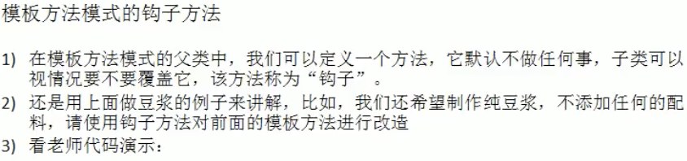
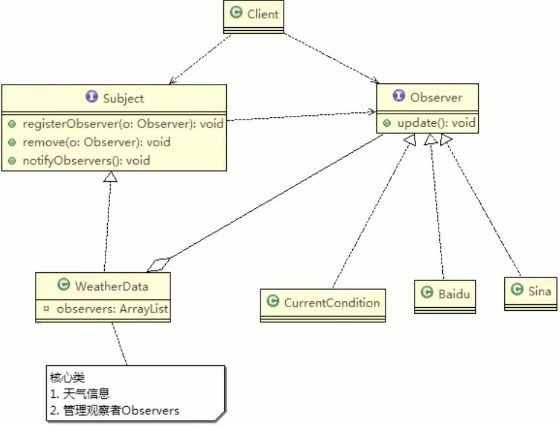
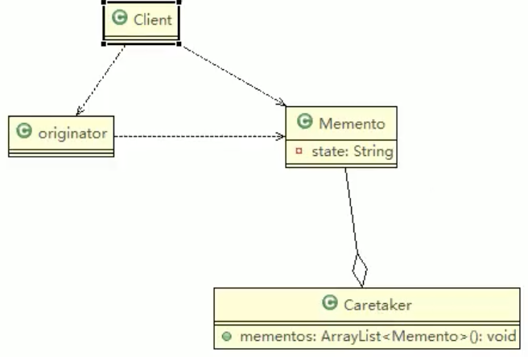
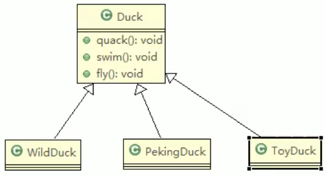
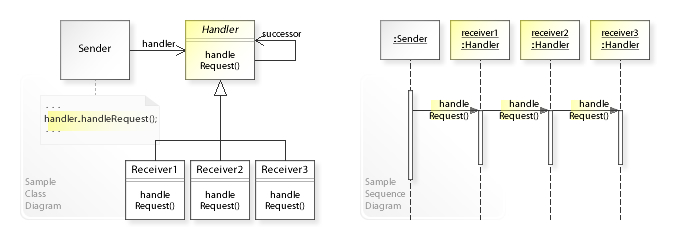

# # 行為型模式（通過中間類的行為型模式）

## 13. 模板方法模式（template）


> Example





> Spring


## 14. 命令模式（command）

命令模式 將“請求”封裝成對象，以便使用不同的請求、隊列或者日誌來參數化其他對象。命令模式也支持可撤銷的操作。命令模式通過這種封裝的方式實現將客戶端和接收端解耦。

命令模式的優缺點：

 優點：

-  實現客戶端和接受者之間的解耦。 
-  可以動態的添加新的命令。
-  只需要調用同一個方法（doCommand方法）便可以實現不同的功能。

 缺點： 

- 實現一個具體的命令系統，可能要創建很多的具體命令對象。


- **抽象命令接口Command**：定義命令的接口，聲明執行的方法，所有要執行的命令都在這，可以是接口或抽象類。
- **具體的命令對象ConcreteCommand**：持有具體的接受者對象，完成具體的具體的命令。將一個接受者和一個動作綁定，調用接受者相對應操作，實現excute
- **接受者對象Receiver**：接受者對象，知道如何執行一個請求相關動作，真正執行命令的對象。
- **傳遞命令對象Invoker**：持有命令對象，要求命令對象執行請求。
- **客戶端對象Client**：創建具體命令的對象並且設置命令對象的接受者。

> Example


> Spring JDBC Template


## 15. 訪問者模式（visitor）

表示一個作用於某對象結構中的各元素的操作，它使你可以在不改變各元素的類的前提下定義作用於這些元素的新操作。當你想要一個為一個對象的組合增加新的能力，且不用改變封裝的結構元素時，就可以使用訪問者模式。

優點：

- 允許對所有節點加入新的操作（新的訪問者對象），並且不改變節點對象本身
- 加入新的操作相對容易

缺點：

- 實現起來過於復雜（強行使用兩次分派，建議只有在必須使用訪問者模式的時候才需要使用訪問者模式）
- 打破了節點類的封裝。


- **抽象訪問者(Visitor)角色**：抽象的訪問者接口，定義針對所有的不同的具體節點做出的對應的反應。
- **具體訪問者(ConcreteVisitor)角色**：實現抽象訪問者所定義的接口
- **抽象節點(Node)角色**：抽象的樹節點接口，定義接受一個訪問者對像作為參數。
- **具體節點(ConcreteNode)角色**：實現了抽象節點所規定的接受操作，以自身作為訪問者對象調用的參數。
- **結構對象(ObjectStructure)角色**：保存所有具體節點的容器。

> Example


## 16. 迭代器模式（iterator）


- Iterator：提供一種方式，使得實現了此接口的聚合對象通過迭代的方式遍曆元素，含 hasNext(, next, remove
- ConcreteIterator：具體迭代器，管理迭代
- Aggregate：統一的聚合接口，將客戶端和具體拒和解偶
- ConcreteAggregate：持有對象集合，並提供一個方法，返回一個迭代器，該迭代器可議正確便利集合
- Client：通過 Iterator, Aggregate 依賴子類

> Example


> Java Iterator


## 17. 觀察者模式（observer）

觀察者模式又叫（發布-訂閱）模式，觀察者通過監聽某個主題，一旦主題的狀態發生改變，則自動通知觀察者。


> Traditional


> Observer



> jdk
>
> Observable 類使用觀察者模式，是類不是接口，通過繼承實現觀察者模式


## 18. 中介者模式（mediator）


> Tradition


> mediator


## 19. 備忘錄模式（memento） 




Originator：對象（需要保存狀態的對象）

Memento：備忘錄對象，負責保存好對象，即 originator 內部狀態

Caretaker：守護者對象，負責保存多個備忘錄狀態，用集合管理，提高效率

如果希望保存多個 originator 對象的不同時間狀態，需要使用 ` HashMap<String, 集合>`


> Traditional

```
遊戲角色
object1 <---> object1 state
object2 <---> object2 state
object3 <---> object3 state
```


> memento


## 20. 解釋器模式（interpreter）

給定一個語言，定義它的文法的一種表示，並定義一個解釋器，這個解釋器使用該表示來解釋語言中的句子。使用解釋器模式為語言創建解釋器。

優點：

- 將每一種語法規則都定義為一個單獨的類，實現單一職責。
- 語法規則通過許多類的形式表示，容易擴展語法。

缺點：

- 語法規則過多時，產生大量的語法類，使得這些語法類變得難以維護和管理


- **抽象的解釋器AbstractExpression**：定義解釋操作的接口，例如:interpret()
- **終結符表達式TerminalExpression**：為文法的終結符實現解釋操作。例: R1+R2=R，R1和R2便是終結符。
- **非終結符表達式NonterminalExpression**：為文法的非終結符實現解釋操作。例: R1+R2=R，+便是終結符。
- **環境對象Context** :包含解釋器以外的一些全局信息，一般用來存儲終結符的具體信息。例: R1=2，R2=3用來存儲具體的數值。


> Tradition


> interpreter


## 21. 狀態模式（state）

允許對像在內部狀態改變時，改變它的行為，對像看起來好像修改了它的類。當一個對象的行為改變根據它的狀態而改變時，就可以使用狀態模式。


**具體對象Context**：維護具體狀態 State 的實例，定義當前的狀態
**抽象狀態對象State**：抽象狀態接口，定義狀態改變時Context對象行為改變的方法（定義一個接口封裝與 Context 的一個特定接口相關行為）
**具體狀態對象ConcreteState**：具體的狀態對象，每一種狀態對應Context對象的一種具體的行為。


狀態模式的關係圖和策略模式的關係圖基本上是一樣的

- **對於狀態模式：**將Context的行為改變封裝到了狀態對像中，Context的行為隨著狀態的改變而改變，而外部不需要知道內部狀態的具體實現規則，只知道Context的行為改變了（如按了開關之後，知道燈開了，但並不知道燈的狀態也改變了）
- **對於策略模式：**通常是外部主動根據具體情況選擇了對應的策略（如警察叔叔對像在司機對象吹完酒精檢測儀之後，根據結果選擇了醉酒駕駛的策略）

優點：

- 將特定狀態對應的行為局部化，將不同狀態的行為分割開來
- 將具體的狀態改變交由子類來完成，避免了互相之間的依賴

缺點：

- 具體狀態類的增加

> State


> State.Money


## 22. 策略模式（strategy）

準備一組同一類的算法，並且將每個算法封裝到具有共同接口的獨立的類中，從而使得客戶端可以靈活的進行算法的切換，客戶端自行決定使用哪種算法。


- 環境(Context) 對象：持有一個Strategy的引用，並根據具體情況執行具體策略。
- 抽象策略(Strategy) 對象：這是一個抽象角色，通常由一個接口或抽像類實現。此對象規定所有的具體策略類所需的接口。
- 具體策略(ConcreteStrategy) 對象：封裝了具體相關的算法或行為。


優點：

- 客戶端可以靈活的選擇不同的策略，並且可以在不修改源碼的情況下增加新的策略。
- 策略模式提供了管理各種具體策略的方法。
- 避免的使用多重（if-else）判斷語句，易於維護。

缺點：

- 客戶端必須清楚所有的具體策略，並決定使用哪一個策略
- 產生大量的策略類

> Tradition




> strategy


> Jdk Comparator 


## 23. 責任鏈模式（chain） 

客戶端將請求發送到一組責任鏈中，責任鏈中的多個處理器依次處理，如A處理器先處理，沒有處理，則B處理器開始處理，依次類推，處理完成之後交由請求接受者，客戶並不知道具體是哪個處理器處理了請求，從而實現了客戶端與請求接受者之間的解耦。當你想要讓多個對像有機會處理同一個請求的時候，就可以使用責任鏈模式。

責任鏈模式（Chain of Responsibility Pattern）或稱職責鏈模式，為請求創建一個接收者對象鍊。這種模式對請求的發送者和接受者之間進行解耦。

責任鏈模式通常每個接收者都包含對另一個接收者的引用。如果一個對象不能處理該請求，那麼他會把相同請求傳給下一個接收者，依此類推。




- Handler：抽象的處理器，定義個處理請求接口方法，同時包含另外Handler。
- ConcreteHandlerA：具體的處理器對象，每個處理器只處理請求中自己可以處理的部分。可以訪問他的後繼者（即下一個處理者），如果可以處理當前請求，則處理，否則將該請求交給他的後繼者，從而形成一個責任鏈
- Request：表示一個請求


> 責任鏈模式的純與不純

純的責任鏈模式：

- 純的責任鏈模式要求一個處理器只能在兩個行為中選擇一個：一是處理請求，二是把請求傳遞給下級處理器處理。不允許出現某一個處理器在處理了一部分請求後又把請求向下級傳遞的情況。
- 在純的責任鏈模式裡面，一個請求必須被某一個處理器處理。

不純的責任鏈模式：

- 不純的責任鏈模式可以在處理了請求之後，再將請求傳遞給下級處理器再進行處理。
- 在不純的責任鏈模式裡面，一個請求可以最終不被任何處理器對象處理。

> 責任鏈模式的優缺點：

優點：

- 實現了客戶端對象和接受對象之間的解耦。
- 可以動態的增加責任鏈中的處理器，擴展性比較好。

缺點：

- 效率較低，一個請求可能要走完責任鏈的中的每一個的環節，就比如手機外殼的請求。


> Tradition


> chain


> SpringMVC


